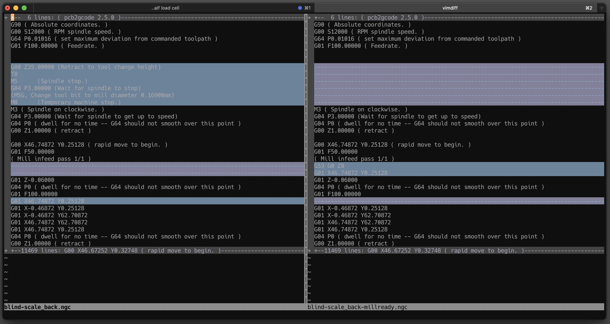

# pcb2gcode-millready



A Python utility to optimize G-code files generated by [pcb2gcode](https://github.com/pcb2gcode/pcb2gcode) for CNC milling operations.

**Note: This code and documentation was mostly generated with the assistance of AI (Claude).**

## Features

This tool performs one main optimization:

1. **Swaps Z and X/Y moves** — This arranges the first plunge operation to ensure the tool moves to Z=0, then to the XY starting position, before plunging; this reduces the risk of damage to the drill bit and the jig.

## Installation

No installation is required. The script is a standalone Python file that requires Python 3.

```bash
# Clone the repository or download the script
git clone https://github.com/thomergil/pcb2gcode-millready
cd pcb2gcode-millready

# Make the script executable (Linux/macOS)
chmod +x pcb2gcode-millready
```

## Usage

Basic usage:

```bash
./pcb2gcode-millready input.ngc output.ngc
```

Where:

- `input.ngc` is your G-code file generated by pcb2gcode
- `output.ngc` is the path where the modified G-code will be saved

### Command-line Options

The script supports the following command-line options:

```
  -h, --help            Show this help message and exit
  --version             Show program's version number and exit
```

### Examples

Process a G-code file:

```bash
./pcb2gcode-millready trace.ngc trace_millready.ngc
```

## Workflow with pcb2gcode

1. Generate G-code from your PCB files using pcb2gcode
2. Process the G-code with this utility
3. Run the optimized G-code on your CNC machine

Example workflow:

```bash
# Generate G-code with pcb2gcode
# pcb2gcode [...]

# Process the generated G-code
./pcb2gcode-millready front.ngc front_millready.ngc
./pcb2gcode-millready outline.ngc outline_millready.ngc
./pcb2gcode-millready drill.ngc drill_millready.ngc

# Use the optimized files with your CNC controller
```

## License

This project is licensed under the MIT License - see the [LICENSE](LICENSE) file for details.
