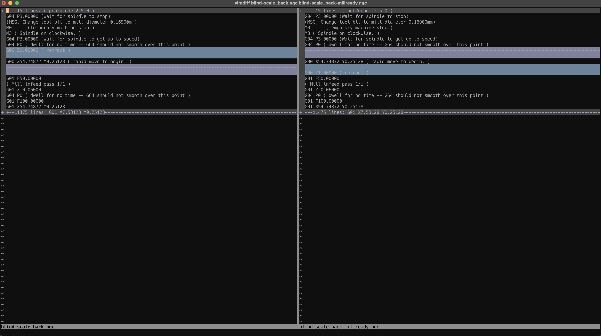

# pcb2gcode-millready



A Python utility to modify G-code files generated by [pcb2gcode](https://github.com/pcb2gcode/pcb2gcode) to swap the initial XY/Z movements and optionally remove M6 tool change sequences.

**Note: This code and documentation were mostly generated with the assistance of AI (Claude).**

## Features

- **Swaps the initial Z and X/Y moves** - Arranges the first plunge operation to ensure the tool moves to Z=0 (all the way up) and then to the XY starting position before plunging down, reducing the risk of damage to the drill bit and the jig.
- **Removes M6 tool change sequences** - Optionally removes tool change sequences from G-code files.

## Installation

```bash
# Clone the repository or download the script
git clone https://github.com/thomergil/pcb2gcode-millready
cd pcb2gcode-millready

# Make the script executable (Linux/macOS)
chmod +x pcb2gcode-millready
```

## Usage

Basic usage:

```bash
./pcb2gcode-millready input.ngc output.ngc
```

Remove M6 tool change sequences:

```bash
./pcb2gcode-millready --remove-m6 input.ngc output.ngc
```

Where:

- `input.ngc` is your G-code file generated by pcb2gcode
- `output.ngc` is the path where the modified G-code will be saved

### Examples

Process a G-code file generated by `pcb2gcode`:

```bash
./pcb2gcode-millready trace.ngc trace_millready.ngc
```

Remove tool changes and process:

```bash
./pcb2gcode-millready --remove-m6 milldrill.ngc milldrill_millready.ngc
```

## License

This project is licensed under the MIT License - see the [LICENSE](LICENSE) file for details.
